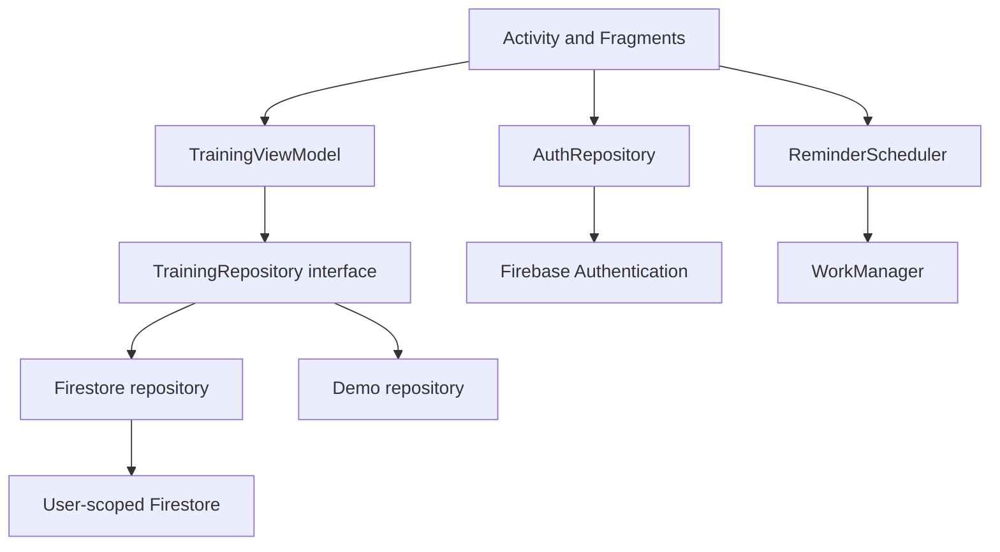

# GymStats

An Android training journal built with Kotlin, Material 3 and Firebase. Create routines, record the repetitions and load you actually complete, and follow your workout history and progress.

Original academic project by **David López Alcañiz, Pablo Rios Garrido and Manuel Magaz Cárdenas**, extended with workout tracking, a redesigned UI and a stronger data layer.

> **Verification status:** this delivery is a reconstructed source project. Static consistency checks passed; its Gradle build, unit/security/UI tests and connected Firebase flows still need execution. See [VERIFICATION.md](docs/VERIFICATION.md). Results from the interrupted earlier version are not evidence for this ZIP.

## Features implemented in source

- Email/password authentication, password reset and Google sign-in through Credential Manager.
- Explicit demo with sample data, isolated from Firebase and reset on sign-out or process termination.
- Routine CRUD: 1–6 exercises, target sets/repetitions/load, up to 20 planned sets.
- Workout sessions: record actual repetitions and weight per set, rest timer, rotation-safe drafts.
- Completed-session snapshots: modifying or deleting a routine keeps historical names and sets unchanged.
- Weekly/monthly training counts, daily training streak, seven-week volume chart and per-exercise maximum-load progress.
- Material 3 cards and inputs, FAB, bottom navigation, custom adaptive icon, empty/loading/error states and retry.
- English/Spanish and system/light/dark appearance.
- Per-account day/time reminders, WorkManager, contextual notification permission and cancellation on sign-out.
- User-scoped Firestore paths, server-side nested validation and atomic session writes.

## Open and run

Use Android Studio supporting AGP 9.2, JDK 17, SDK platform/build tools 36 and Android 8.0+ (API 26). The included wrapper uses Gradle 9.4.1. No Kotlin Android plugin is added because AGP 9 includes Kotlin support.

```sh
./gradlew testDebugUnitTest lintDebug assembleDebug assembleDebugAndroidTest
```

Open the `GymStats` directory in Android Studio, sync and run `app`. Select **Explore demo** to review the UI without cloud configuration. No Firebase JSON is active by default; account sign-in explains that configuration is required. Demo sample data is visibly marked and memory-only.

Windows: use `gradlew.bat` instead of `./gradlew`.

## Firebase setup

The namespace and default application ID are **org.gymstats.android**. Register this Android app in your existing Firebase project, configure Email/Password and Google providers, add signing fingerprints and place its freshly downloaded configuration in `app/google-services.json`.

Your original JSON is preserved in `private-config/google-services.json` for your convenience and excluded from Git. It belongs to the old Android application ID; copying it into the new app without changing the application ID will fail Google services processing. [Setup and compatibility instructions](docs/FIREBASE_SETUP.md) include a temporary legacy option.

Nothing in this delivery deploys to your Firebase account. Review and test the rules, then deploy to the project you choose:

```sh
npx firebase-tools deploy --only firestore:rules,firestore:indexes --project YOUR_PROJECT_ID
```

## Architecture



- `domain/`: Kotlin models, validation, metrics and local-time scheduling; no Android UI dependencies.
- `data/`: repository interface, Firebase adapters, listeners, coroutines and atomic batches; separate explicit demo.
- `ui/`: lifecycle-aware StateFlow, typed result events, ViewBinding cleanup, ListAdapter/DiffUtil, saved drafts and chart rendering.
- `worker/`: unique per-user work, persisted preferences and authorization checks before notification delivery.

The ViewModel accepts a repository through `connect`; the Activity owns the current authenticated/demo session. This is a small MVVM application with a repository boundary, not a claim of full Clean Architecture or a DI framework.

## Data model

```text
users/{uid}/routines/{routineId}
users/{uid}/workouts/{workoutId}
users/{uid}/workouts/{workoutId}/chunks/{0..3}
```

A completed session contains stable metadata, a set count and a chunk count. Its actual sets are saved in 1–4 chunks of at most five sets. Parent and chunks are committed in one batch. Rules validate every chunk, require the parent and chunks together, verify counts and allow only identical retries after creation. This keeps nested validation within Firestore's expression budget. Workout deletion removes its parent and chunks in a batch; deleting a routine preserves completed sessions.

Existing routines without `exercises` still load. Edit them to add exercises before starting a workout; the app does not invent a migration or overwrite your previous data automatically.

## Metric definitions

- External-load volume = sum of actual `reps × weight`, in kg. Bodyweight sets recorded at 0 kg contribute 0 kg.
- Calendar weeks start Monday; week/month boundaries use the device's local time zone.
- Streak counts consecutive calendar days with workouts, including a streak ending yesterday. Multiple sessions in a day contribute one streak day.
- Progress groups exercise names case-insensitively and plots the maximum set weight per workout. Renaming an exercise starts another named history; stored snapshots keep the old name.
- Volume shows seven calendar weeks; progress displays the latest 30 workouts containing the selected exercise.

## Tests and CI

23 unit tests, 17 Firestore Rules tests and 2 Espresso tests are included. They are **authored, not executed against this reconstructed version**.

```sh
# Build, JVM tests and lint
./gradlew testDebugUnitTest lintDebug assembleDebug assembleDebugAndroidTest
# Running Android device/emulator
./gradlew connectedDebugAndroidTest
# Node 22 and Java 17
npm install --ignore-scripts --no-audit --no-fund
npm run test:rules
# Source/resource consistency only
python3 tools/verify_static.py
```

The security suite uses a local `demo-gymstats` emulator project and does not modify a real Firebase project. CI runs build/unit/lint checks and emulator-based rules tests; it compiles the Espresso APK but does not execute UI tests on a device. Generate and commit `package-lock.json` after installing dependencies if you want fully locked transitive Node dependencies, then switch CI to `npm ci`.

## Screenshots

Real screenshots are pending device execution. No mockup is presented as a running app. Follow [manual QA](docs/MANUAL_QA.md) and use `tools/capture_screenshot.sh` while each screen is visible. The README should be illustrated with real screenshots before publishing the project as a portfolio piece.

## Practical limits

- WorkManager reminders are approximate, can arrive late and require enabled Android permissions/channels. They use local time and are disabled in demo mode.
- Firestore can display cached data offline. Save remains visibly pending until acknowledgement from the server. The editor/session cannot be left using Back during a pending save.
- Drafts survive normal rotation and saved-state restoration; they are not a durable backup after force-stop, clearing data or arbitrary process loss. Demo data is transient.
- Immutable workout chunks are fetched when parent collection snapshots change. Large histories should add paging and selective queries before production-scale use.
- Duplicate exercise IDs are rejected by client validation; rules bound and validate their fields but do not enforce pairwise ID uniqueness.
- App Check, account deletion/export, email-verification policy, publishing/signing and store distribution remain future production work.

## References

- [AGP 9.2 compatibility](https://developer.android.com/build/releases/agp-9-2-0-release-notes)
- [Google sign-in and Credential Manager](https://developer.android.com/identity/sign-in/credential-manager-siwg)
- [Firestore field validation](https://firebase.google.com/docs/firestore/security/rules-fields)
- [WorkManager](https://developer.android.com/develop/background-work/background-tasks/persistent-work)
